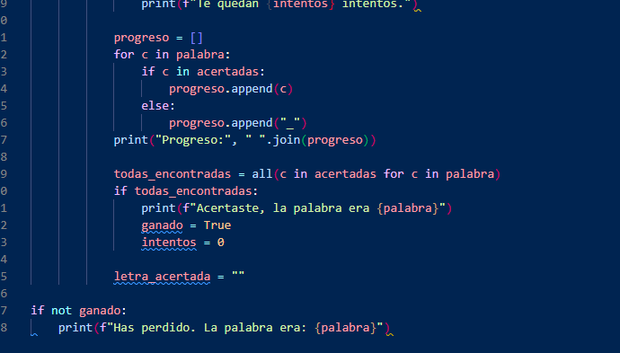

# Ahorcado
-Intenta adivinar una palabra letra por letra antes de un numero de intentos.
-Cada turno introduces una letra (solo de la a a la z) y el juego muestra tu progreso reemplazando las letras no acertadas por guiones bajos.
-Si la letra está en la palabra se revela en todas sus posiciones; si no, pierdes un intento.
-Ganas si descubres todas las letras antes de quedarte sin intentos; pierdes si los intentos llegan a cero y entonces se muestra la palabra completa.

-En la ultima parte del Juego he tenido que usar ia para ayudarme a saber como hacer que me salieran las "_" segun las letras que faltasen.

